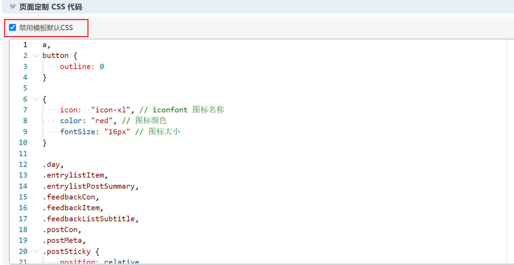
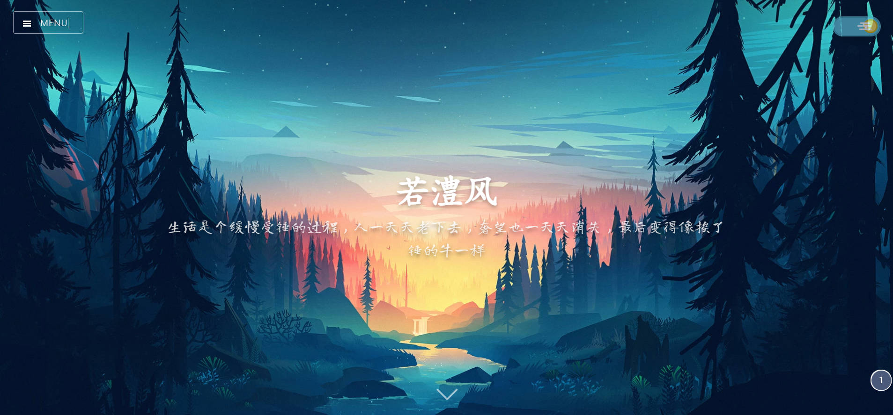
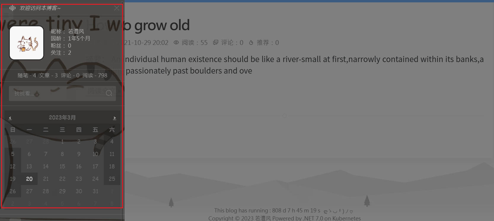
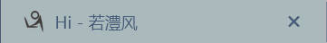
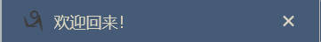
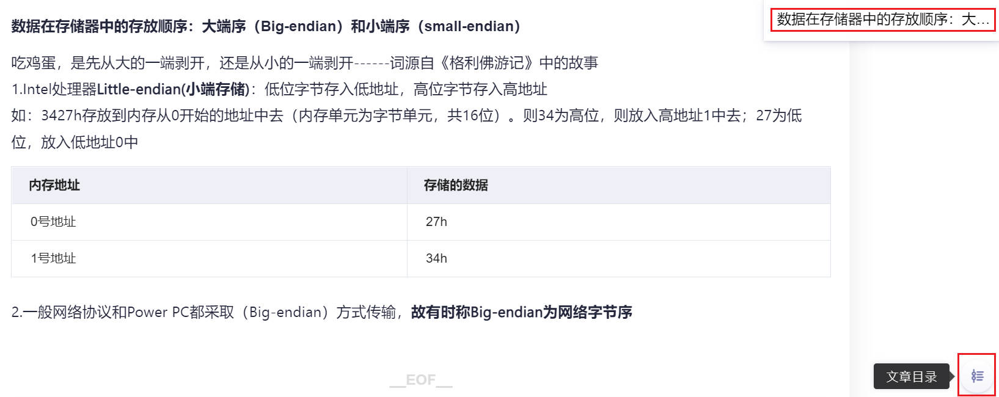

# Blogs_Theme_Definition
自定义博客园主题的一些历程~

参考文档：https://bndong.github.io/Cnblogs-Theme-SimpleMemory/v2/#/

## 0. CSS 文件配置

将 `simpleMemory.css` 文件粘贴到后台 CSS 代码处：



## 1. 主页配置

**自定义配置项目：`window.cnblogsConfig`**

### 1.1 自定义主页背景

背景图片自定义：尺寸 `>= 1920×1080`，支持多张，每次刷新随机变换一张。

```html
window.cnblogsConfig = {


    banner: {
        home: {
            background: [
                "https://x1.jpg",
                "https://x2.jpg",
                "https://x3.jpg",
            ],
        },
    },


}
```



### 1.2 自定义标题

```html
banner: {
        title: [
                '每一个不曾起舞的日子，都是对生命的辜负。',
                '公主死去了，屠龙的少年还在燃烧'
            ],
    },
```

### 1.3 侧边栏背景图片



```html
sidebar: {
    infoBackground: "https:×××××××.jpg",
  },
```

### 1.4 网页标签



```html
title: {
    onblur: 'Hi',
    focus: '欢迎回来！',
  },
```

### 1.5 文章目录



```html
 articleDirectory: {
        position: 'right',
        minBodyWeight: 1400,
    },
```

