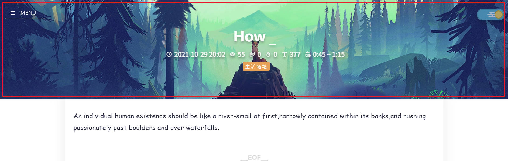
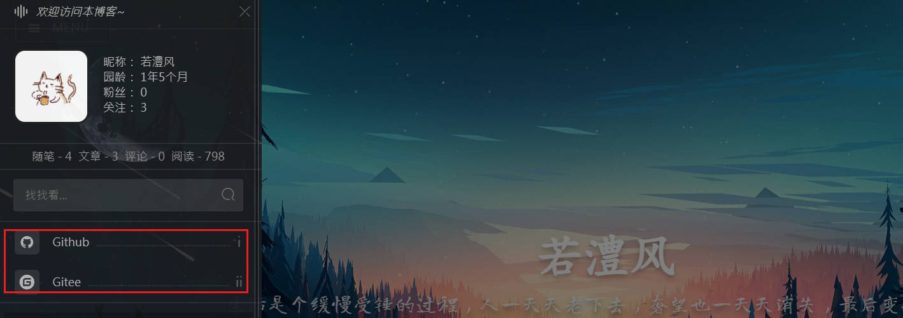

# Blogs_Theme_Definition
自定义博客园主题的一些历程~

参考文档：https://bndong.github.io/Cnblogs-Theme-SimpleMemory/v2/#/

## 0. CSS 文件配置

将 `simpleMemory.css` 文件粘贴到后台 CSS 代码处：


## 1. 自定义配置

**自定义配置项目：`window.cnblogsConfig`**

### 1.1 自定义页面图片

**主页图片**

背景图片自定义：尺寸 `>= 1920×1080`，支持多张，每次刷新随机变换一张。

```json
window.cnblogsConfig = {


    banner: {
        home: {
            background: [
                "https://x1.jpg",
                "https://x2.jpg",
                "https://x3.jpg",
            ],
        },
    },


}
```


**文章页图片**

```json
article: {
            background: [
                "https://x1.jpg",
                "https://x2.jpg",
                "https://x3.jpg",
            ],
        },
```



### 1.2 自定义标题

```json
banner: {
        title: [
                '每一个不曾起舞的日子，都是对生命的辜负。',
                '公主死去了，屠龙的少年还在燃烧'
            ],
    },
```

### 1.3 侧边栏背景图片


```json
sidebar: {
    infoBackground: "https:×××××××.jpg",
  },
```

### 1.4 网页标签


```json
title: {
    onblur: 'Hi',
    focus: '欢迎回来！',
  },
```

### 1.5 文章目录


```json
 articleDirectory: {
        position: 'right',
        minBodyWeight: 1400,
    },
```

https://github.com/Wanggs2418

### 1.6 侧边栏中链接

```json
//图标设置,较为繁琐，可不设置 info 内容 ，直接用引用的图标样式
info: {
    blogIcon: 'https://x1.jpg',
  },

sidebar: { // 列表数据 ['导航名称', '链接', 'icon']
    navList: [
        ['Github', 'https://github.com/Wanggs2418', 'icon-github'],
        ['Gitee', 'https://gitee.com/Ruliyjlu', 'icon-gitee'],
    ],
  },
```


